<!-- ============ HEADER BANNER ============ -->

<!-- Typing animation subtitle -->

**M.S. Computer Science &amp; Technology (Cybersecurity)**
University of Electronic Science and Technology of China (UESTC), Chengdu 🇨🇳

**President, Uganda Students' Association in China (2026/27)**

 

  

<!-- ============ ABOUT ============ -->

## 👨‍💻 About Me

> I research **secure, privacy-preserving machine learning systems**, focused on Byzantine-robust federated learning for network intrusion detection. My work combines trust-aware aggregation with differential privacy to keep distributed models resilient against malicious participants without sacrificing data privacy.
>
> Outside research, I build full-stack applications with **Next.js, TypeScript, and Python**, mostly at the intersection of education, AI, and cybersecurity.

### 🎯 Current Focus

<table>
  <tr>
    <td>🔬 Byzantine-Robust Federated Learning</td>
    <td>🛡️ Network Intrusion Detection Systems</td>
  </tr>
  <tr>
    <td>🤖 Applied Machine Learning &amp; AI Security</td>
    <td>🌐 Full-Stack Development with Next.js</td>
  </tr>
  <tr>
    <td>📚 Distributed Systems</td>
    <td>🔐 Privacy-Preserving AI</td>
  </tr>
</table>

<!-- ============ RESEARCH ============ -->

## 🔬 Research &amp; Selected Projects

*Some of these live in private repos (thesis/competition work); descriptions are here for context.*

<b>🧠 PreFed-IDS — Byzantine-Robust Federated Learning for Intrusion Detection</b>

 

Master's thesis project. Trust-aware aggregation and DP-SGD (via Opacus) on top of a Flower-based federated learning pipeline, evaluated on CIC-IDS2017 and UNSW-NB15 for resilience against poisoning attacks.

<b>🇩🇪 JiaYou-AufGehts — German Language Learning Platform</b>

 

Full-stack platform for Chinese users learning German, with integrated WeChat Pay, Alipay, and card payments via Airwallex.

<b>🌍 LearnLink 学桥 — AI-Powered Digital Literacy Platform</b>

 

Digital literacy platform targeting learners in Uganda, built for the African Youth AI Case Innovation Competition.

<b>🛍️ AfroCraft — African Crafts Marketplace</b>

 

E-commerce platform for African crafts, with Stripe-powered checkout and a CMS-driven product catalog.

<b>📈 Financial News Sentiment Analysis &amp; Stock Prediction</b>

 

Bachelor's thesis project. Sentiment-driven stock prediction using FinBERT, VADER, and LSTM architectures on 1.8M+ financial news headlines.

<!-- ============ PERSONAL PROJECTS ============ -->

## 🧪 Personal Projects

*Private repos, built for fun and to sharpen different parts of the stack.*

| Project | Description | Stack |
| :------ | :---------- | :---- |
| ✍️ **Ink-Motion** | Reading &amp; writing app (Chinese + English) with a motion-driven interface | `Next.js` `TypeScript` `Three.js` `Zustand` |
| 📖 **ContextTo-Chinese** | Interactive Chinese reading &amp; dictionary SaaS with contextual lookups | `Next.js` `TypeScript` `Supabase` `Auth.js` |
| 🎬 **Convertify** | Tool for converting videos to audio | `Next.js` `TypeScript` |
| 🖥️ **MLFQ-OS-Scheduler** | Multi-level feedback queue scheduler with priority aging &amp; adaptive quanta | `Python` |

<!-- ============ PUBLIC REPOS ============ -->

## 🚀 Public Repositories

| Project | Description |
| :------ | :---------- |
| 📊 **Log Analyzer** | Browser-based log analysis with regex filtering, parsing, and exports |
| 📄 **Document Converter** | PDF and Word document conversion platform |
| 🤖 **AI Assignments 2025** | Search algorithms, MDPs, regression, and AI coursework |
| 🔐 **Password Manager** | Local-first password management application |
| ♟️ **Checkers** | Classic checkers implementation in Python |

<!-- ============ HIGHLIGHTS ============ -->

## 🏆 Highlights

- 🎓 M.S. Candidate in Cybersecurity at **UESTC**
- 🌍 **President**, Uganda Students' Association in China (2026/27)
- 📈 Built financial sentiment models on **1.8M+ headlines** using FinBERT and LSTM
- 🌐 Shipped **multiple full-stack platforms** end to end, from data layer to UI

<!-- ============ TECH STACK ============ -->

## 🛠️ Technologies

**Languages**

**Frameworks &amp; Tools**

<!-- ============ GITHUB STATS ============ -->

## 📈 GitHub Statistics

 

 

## 🏅 Trophies

<!-- ============ RESEARCH INTERESTS ============ -->

## 📚 Research Interests

`Federated Learning Security` · `Byzantine-Robust Aggregation` · `Differential Privacy` · `Adversarial Machine Learning` · `Network Intrusion Detection` · `Distributed Systems Security` · `AI for Cybersecurity`

<!-- ============ CONNECT ============ -->

## 📬 Connect

**Interested in research collaboration, cybersecurity projects, AI systems, or full-stack development.**

  

